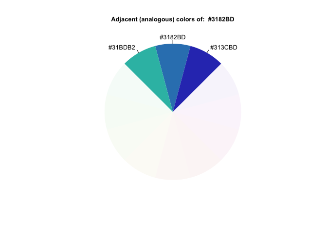
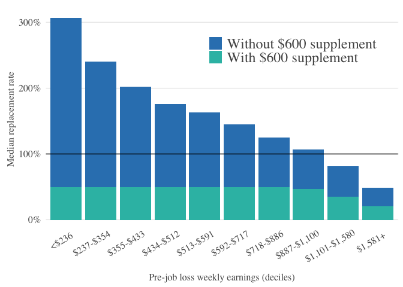
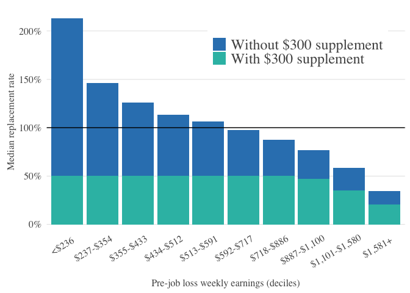

Figure 3a Plots and CSVs
================

``` r
library(tidyverse)
```

    ## ── Attaching packages ─────────────────────────────────────── tidyverse 1.3.1 ──

    ## ✓ ggplot2 3.3.3     ✓ purrr   0.3.4
    ## ✓ tibble  3.1.2     ✓ dplyr   1.0.6
    ## ✓ tidyr   1.1.3     ✓ stringr 1.4.0
    ## ✓ readr   1.4.0     ✓ forcats 0.5.1

    ## ── Conflicts ────────────────────────────────────────── tidyverse_conflicts() ──
    ## x dplyr::filter() masks stats::filter()
    ## x dplyr::lag()    masks stats::lag()

``` r
library(haven)
library(reticulate)
#library(quantreg)
#library(lubridate)
#library(yaml)
#library(rprojroot)
library("RColorBrewer")
#matches <- dplyr::matches

knitr::opts_knit$set(root.dir = '~/repo/ui_rep_rate')
```

``` r
source("../lab_code/prelim.R")
```

    ## Loading required package: testthat

    ## 
    ## Attaching package: 'testthat'

    ## The following object is masked from 'package:dplyr':
    ## 
    ##     matches

    ## The following object is masked from 'package:purrr':
    ## 
    ##     is_null

    ## The following object is masked from 'package:tidyr':
    ## 
    ##     matches

``` r
wages <- read_csv("analysis/release/wages_with_replacement_rates.csv")
```

    ## 
    ## ── Column specification ────────────────────────────────────────────────────────
    ## cols(
    ##   .default = col_double(),
    ##   state = col_character(),
    ##   binned_age = col_character(),
    ##   male = col_logical(),
    ##   two_digit_occ = col_character(),
    ##   weekly_employer_contribution = col_logical()
    ## )
    ## ℹ Use `spec()` for the full column specifications.

``` r
deciles <- read_rds("analysis/release/deciles.rds")

logit_fit <- read_rds("analysis/release/logit_fit.rds")

wages_logit_weights <- read_csv("analysis/release/wages_logit_weights_filtered.csv")
```

    ## 
    ## ── Column specification ────────────────────────────────────────────────────────
    ## cols(
    ##   .default = col_double(),
    ##   state = col_character(),
    ##   binned_age = col_character(),
    ##   male = col_logical(),
    ##   two_digit_occ = col_character(),
    ##   weekly_employer_contribution = col_logical(),
    ##   inc_decile = col_character()
    ## )
    ## ℹ Use `spec()` for the full column specifications.

``` r
wages_logit_weights <- wages %>%
  mutate(inc_decile = cut(weekly_earnings, deciles),
         two_digit_ind = as.factor(two_digit_ind)) %>%
  broom::augment(logit_fit, newdata = .,
                 type.predict = "response") %>%
  mutate(weight = weight * .fitted)

elig_deciles <- wages_logit_weights %>%
  with(Hmisc::wtd.quantile(weekly_earnings,
                           weight,
                           seq(0, 1, length.out = 11)))
elig_deciles[1] <- -Inf
elig_deciles[11] <- Inf

# old code I copied and pasted from /analysis/source/plot_ui.R:
#
# replacement_rate_by_decile <- wages_logit_weights  %>%
#   mutate(eligible_decile = cut(weekly_earnings, elig_deciles)) %>%
#   group_by(eligible_decile) %>%
#   summarise_at(vars(contains("replacement_rate")),
#                ~ Hmisc::wtd.quantile(.x, weights = weight, probs = 0.5)) %>%
#   mutate(replacement_rate_FPUC = replacement_rate_FPUC - replacement_rate,
#          replacement_rate_Jan = replacement_rate) %>%
#   select(-replacement_rate) %>%
#   pivot_longer(cols = contains("replacement"), names_to = "type",
#                values_to = "replacement_rate", names_prefix = "replacement_rate_")

decile_rep_rates_600 <- wages_logit_weights  %>%
  mutate(eligible_decile = cut(weekly_earnings, elig_deciles)) %>%
  group_by(eligible_decile) %>%
  summarise_at(vars(contains("replacement_rate")),
               ~ Hmisc::wtd.quantile(.x, weights = weight, probs = 0.5)) %>%
  rename(replacement_rate_Jan = replacement_rate) %>%
  pivot_longer(cols = contains("replacement"), names_to = "type",
               values_to = "replacement_rate", names_prefix = "replacement_rate_")

write.csv(decile_rep_rates_600, "analysis/release/fig3_rep_rates_600.csv")

decile_rep_rates_300 <- wages_logit_weights %>%
  mutate(replacement_rate_FPUC = (benefits_amount + 300)/weekly_earnings,
         eligible_decile = cut(weekly_earnings, elig_deciles)) %>%
  group_by(eligible_decile) %>%
  summarise_at(vars(contains("replacement_rate")),
               ~ Hmisc::wtd.quantile(.x, weights = weight, probs = 0.5)) %>%
  rename(replacement_rate_Jan = replacement_rate) %>%
  pivot_longer(cols = contains("replacement"), names_to = "type",
               values_to = "replacement_rate", names_prefix = "replacement_rate_")

write.csv(decile_rep_rates_300, "analysis/release/fig3_rep_rates_300.csv")
```

``` r
palette <- RColorBrewer::brewer.pal(6, "Blues")

# old code I copied and pasted from /analysis/source/plot_ui.R
#
# replacement_rate_by_decile %>%
#   filter(type %in% c("FPUC", "Jan")) %>%
#   ggplot(aes(eligible_decile, replacement_rate, fill = type)) +
#   geom_col(position = position_stack()) +
#   geom_hline(yintercept = 1) +
#   scale_x_discrete(labels = label_cuts("dollar")) +
#   scale_y_continuous(labels = scales::percent) +
#   labs(y = "Median replacement rate",
#        x = "Pre-job loss weekly earnings (deciles)") +
#   fte_theme(dark_text = TRUE, legend_title_on = FALSE) +
#   theme(panel.grid.major.x = element_blank(),
#         legend.position = c(0.7, 0.82),
#         axis.text.x = element_text(angle = 30, hjust = .8)) +
#   scale_fill_manual(name = NULL,
#                     #values = c("cornflowerblue","palegoldenrod"),
#                     values = c(palette[5],
#                                colortools::adjacent(palette[5])[3]),
#                     labels = c("Without $600 supplement",
#                                "With $600 supplement"))

decile_rep_rates_600 %>%
   arrange(desc(replacement_rate)) %>%
   ggplot(aes(x = eligible_decile,
              y = replacement_rate,
              fill = type)) +
   geom_col(position = "identity") +
   geom_hline(yintercept = 1) +
   scale_x_discrete(labels = label_cuts("dollar")) +
   scale_y_continuous(labels = scales::percent) +
   labs(y = "Median replacement rate",
        x = "Pre-job loss weekly earnings (deciles)") +
   fte_theme(dark_text = TRUE, legend_title_on = FALSE) +
   theme(panel.grid.major.x = element_blank(),
         legend.position = c(0.7, 0.82),
         axis.text.x = element_text(angle = 30, hjust = .8)) +
   scale_fill_manual(name = NULL,
                     values = c(palette[5],
                       colortools::adjacent(palette[5])[3]),
                     labels = c("Without $600 supplement",
                                "With $600 supplement"))
```

<!-- --><!-- -->

``` r
ggsave("analysis/issue_54_fig3a_csv/quantile_plot_600_FPUC.png", width = 8, height = 4.5)

decile_rep_rates_300 %>%
   arrange(desc(replacement_rate)) %>%
   ggplot(aes(x = eligible_decile,
              y = replacement_rate,
              fill = type)) +
   geom_col(position = "identity") +
   geom_hline(yintercept = 1) +
   scale_x_discrete(labels = label_cuts("dollar")) +
   scale_y_continuous(labels = scales::percent) +
   labs(y = "Median replacement rate",
        x = "Pre-job loss weekly earnings (deciles)") +
   fte_theme(dark_text = TRUE, legend_title_on = FALSE) +
   theme(panel.grid.major.x = element_blank(),
         legend.position = c(0.7, 0.82),
         axis.text.x = element_text(angle = 30, hjust = .8)) +
   scale_fill_manual(name = NULL,
                     values = c(palette[5],
                       colortools::adjacent(palette[5])[3]),
                     labels = c("Without $300 supplement",
                                "With $300 supplement"))
```

<!-- --><!-- -->

``` r
ggsave("analysis/issue_54_fig3a_csv/quantile_plot_300_FPUC.png", width = 8, height = 4.5)
```
